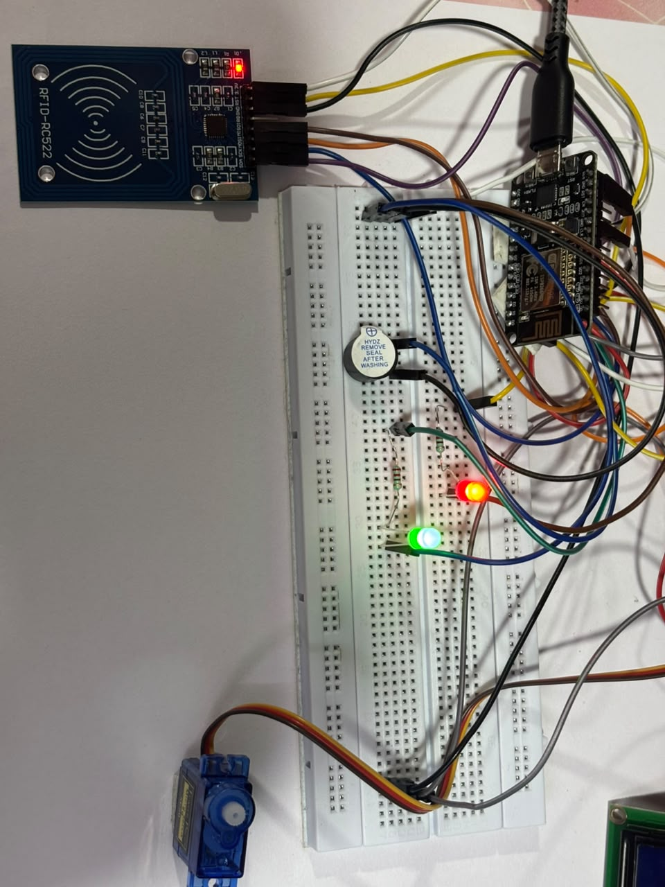
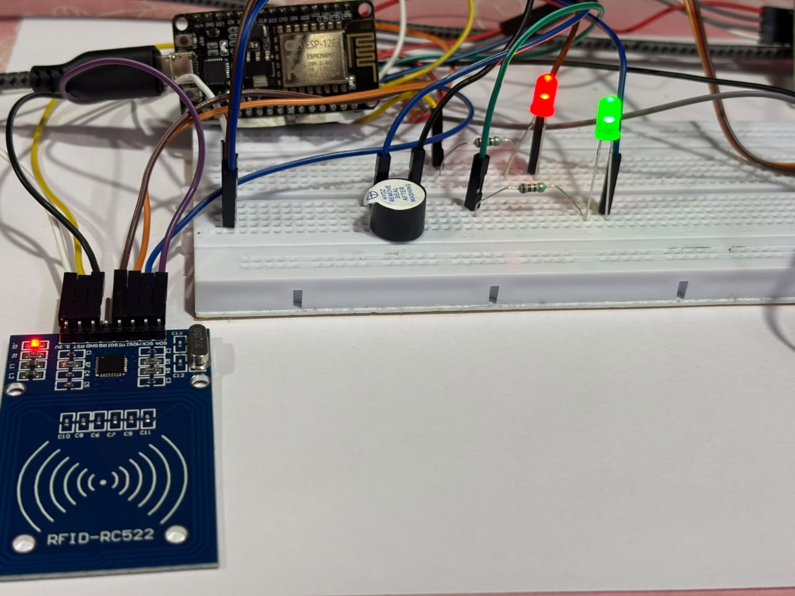
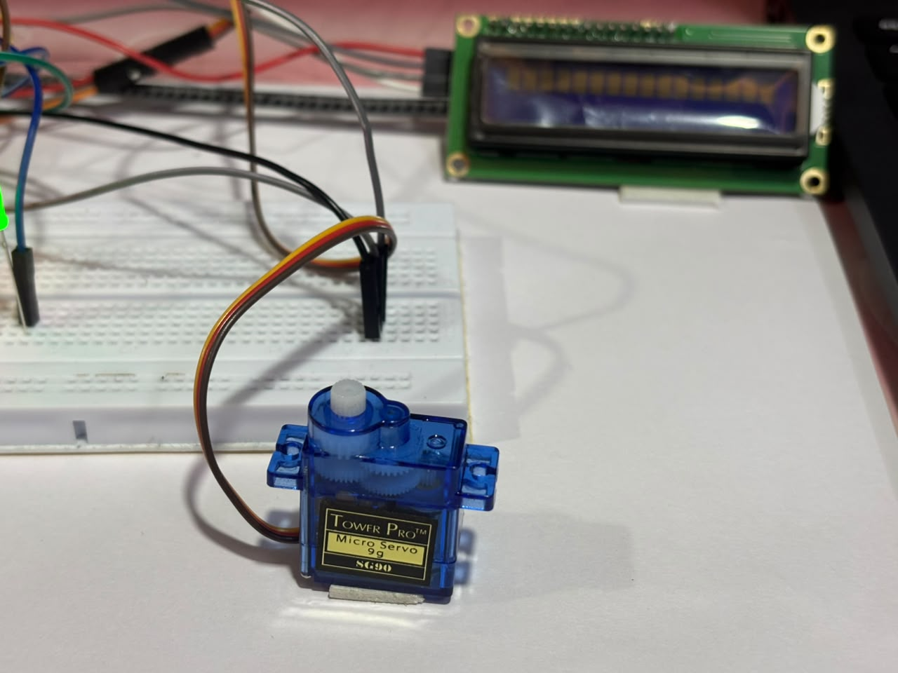

# 🔐 RFID Smart Vault Security System

An embedded security system built using the **ESP8266 NodeMCU** that authenticates RFID cards, unlocks a servo-controlled vault for authorized users, and prevents unauthorized access through visual, audio, and lockout mechanisms.

---

## 📸 Hardware Setup



---

##  Features

- RFID-based authentication using the RC522 module
- Servo motor-controlled vault locking and unlocking
- 16×2 LCD for real-time status display
- Green LED indicates authorized access
- Red LED indicates unauthorized access
- Active buzzer for audio feedback
- Lockout mechanism after multiple failed authentication attempts
- Modular software architecture using PlatformIO

---

## 🛠 Hardware Used

- ESP8266 NodeMCU (ESP8266)
- RC522 RFID Reader
- SG90 Servo Motor
- 16×2 LCD Display (I2C)
- Active Buzzer
- Red LED
- Green LED
- Push Button
- Breadboard
- Jumper Wires
- 220 Ω Resistors

---

## 🔌 Circuit Connections

### RC522 RFID Module

| RC522 | NodeMCU |
|--------|----------|
| SDA (SS) | D8 |
| SCK | D5 |
| MOSI | D7 |
| MISO | D6 |
| RST | D3 |
| 3.3V | 3V3 |
| GND | GND |
| IRQ | Not Connected |

### Servo Motor

| Servo | NodeMCU |
|--------|----------|
| Signal | D4 |
| VCC | 5V / VIN |
| GND | GND |

### LCD Display (I2C)

| LCD | NodeMCU |
|-----|----------|
| SDA | D2 |
| SCL | D1 |
| VCC | VIN / 5V |
| GND | GND |

### LEDs & Buzzer

| Component | NodeMCU |
|-----------|----------|
| Green LED | D5 *(through 220 Ω resistor)* |
| Red LED | D7 *(through 220 Ω resistor)* |
| Active Buzzer | D3 |

> **Note:** Update the pin numbers if your final wiring differs.

---

## 💻 Software

- PlatformIO
- Visual Studio Code
- Embedded C++
- ESP8266 Framework

---

## ⚙️ System Workflow

1. System initializes all peripherals.
2. LCD prompts the user to scan an RFID card.
3. RC522 reads the RFID tag.
4. The UID is compared with the authorized IDs.
5. If the UID matches:
   - LCD displays **Access Granted**
   - Green LED turns ON
   - Servo unlocks the vault
   - Buzzer provides a success indication
6. If the UID does not match:
   - LCD displays **Access Denied**
   - Red LED turns ON
   - Buzzer sounds
   - Failed attempt counter increments
7. After the maximum allowed failed attempts:
   - LCD displays **LOCKED OUT**
   - Buzzer continuously alerts
   - System ignores further scans until reset or timeout.

---

## 📷 Hardware Images

### Overall Setup


### Top View



### Servo Motor



---

## 📂 Project Structure

```text
RFID-Smart-Vault/
│
├── images/
├── videos/
├── include/
├── lib/
├── src/
├── .gitignore
├── platformio.ini
└── README.md
```

---

## 📚 What I Learned

- Interfacing the RC522 RFID reader using SPI communication
- Developing a modular embedded application using PlatformIO
- Controlling an SG90 servo motor using PWM
- Displaying real-time system status on an I2C LCD
- Implementing RFID authentication and lockout logic
- Organizing embedded software into reusable modules
- Hardware debugging, soldering, and circuit troubleshooting

---

##  Future Improvements

- Web dashboard for monitoring
- Firebase integration
- Mobile notifications
- User registration through a web interface
- Event logging with timestamps
- OTA firmware updates

---

# 🎥 Project Demonstration

### Complete System Demo

▶️ [vault_demo.mp4](videos/vault_demo.mp4)

### Access Granted

▶️ [vault_access_granted.mp4](videos/vault_access_granted.mp4)

### Locked Out

▶️ [vault_lockedout.mp4](videos/vault_lockedout.mp4)

---

# 🎞️ Short Preview Clips

### Access Granted Preview

▶️ [rfid_accessgranted_gif.mp4](videos/rfid_accessgranted_gif.mp4)

### Access Denied Preview

▶️ [rfid_accessdenied_gif.mp4](videos/rfid_accessdenied_gif.mp4)

### Locked Out Preview

▶️ [rfid_lockedout_gif.mp4](videos/rfid_lockedout_gif.mp4)

---

## 👩‍💻 Author

**Esha Srinika**

B.Tech – Electronics and Communication Engineering

Built using ESP8266, PlatformIO, and Embedded C++.
